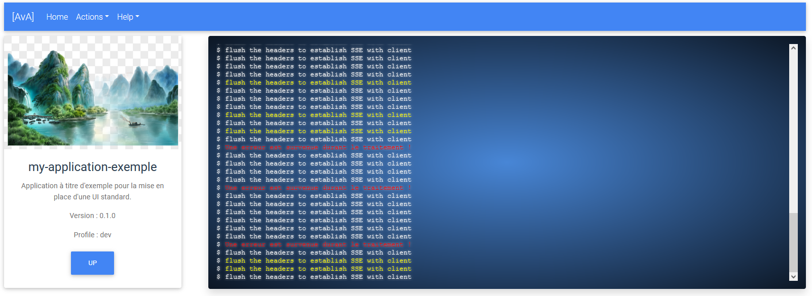

# ms-ui-template

Micro Server UI Template



# Lancement de l'api mock

```bash
cd api
npm install
npm run dev
...
Server listening on the port::3080
```

# Lancement template

```bash
cd src
npm install
npm run serve
```

# Liste des routes exposés par le mock

## Information concernant l'application

```javascript
app.get('/api/v1/info', (req, res) => {
    const infos = { 
        application : {
            name: "my-application-exemple",
            description: "Application à titre d'exemple pour la mise en place d'une UI standard.",
            version: "0.1.0",
            profile: "dev"
        }
    };
    res.json(infos);
});
```

## Sonde de santé

```javascript
app.get('/api/v1/health', (req, res) => {
    res.json({ status: "UP" });
});
```

## Récupération du menu 

```javascript
app.get('/api/v1/menu', (req, res) => {
    var menu = {}
    fs.readFile('menu.json', 'utf8' , (err, data) => {
        if (err) {
          console.error(err)
          return
        }
        res.json(JSON.parse(data));
      })
});
```

## Simulation de la console SSE

```javascript
app.get('/api/v1/console', (req, res) => {
    res.setHeader('Cache-Control', 'no-cache');
    res.setHeader('Content-Type', 'text/event-stream');
    res.setHeader('Access-Control-Allow-Origin', '*');
    res.setHeader('Connection', 'keep-alive');
    res.flushHeaders(); // flush the headers to establish SSE with client

    let counter = 0;
    let interValID = setInterval(() => {
        counter++;
        if (counter >= 10) {
            clearInterval(interValID);
            res.end(); // terminates SSE session
            return;
        }

        messages = [
            { type: "error", message : "Une erreur est survenue durant le traitement !" },
            { type: "info", message : "flush the headers to establish SSE with client" },
            { type: "info", message : "flush the headers to establish SSE with client" },
            { type: "info", message : "flush the headers to establish SSE with client" },
            { type: "warning", message : "flush the headers to establish SSE with client" },
            { type: "info", message : "flush the headers to establish SSE with client" }
        ];

        var message = messages[Math.floor(Math.random()*messages.length)];

        res.write(`data: ${JSON.stringify( message )}\n\n`); // res.write() instead of res.send()

    }, 1000);

    // If client closes connection, stop sending events
    res.on('close', () => {
        console.log('client dropped me');
        clearInterval(interValID);
        res.end();
    });
});
```


# Configuration du proxy Vuejs

vue.config.js :

```javascript
module.exports = {
    devServer: {
      proxy: {
        '/api/v1': {
          target: 'http://localhost:3080/'
        },
        "/actuator": {
          target: 'http://localhost:3080/',
          pathRewrite: {'^/actuator' : '/api/v1'}
        }
      }
    }
  }
```

# Todos

* [] Dynamiser le menu, en utilisant la route **/api/v1/menu**